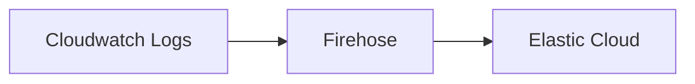
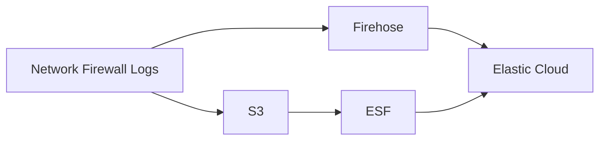
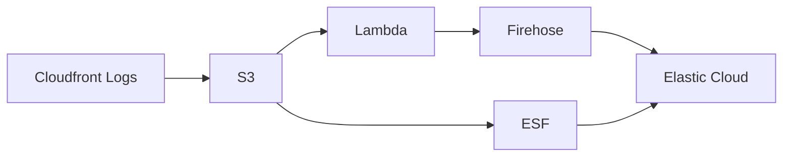

Issue: https://github.com/elastic/obs-infraobs-team/issues/1337.

**Notes about the current state of this repository**:

Most directories have a README file explaining what is happening, so I will not be mentioning that in these notes. `terraform/README.md` mentions the workflows.

The worflow:

Is working. To test it, do the following:

1. Go to `terraform` directory.
2. Create a file to set the variables and make sure `test_workflows` variables includes number `2`.
3. Run `terraform init` and `terraform apply`.
4. Go to `go-script` directory.
5. Run the `main.go`, which will cause the logs in the cloudwatch logs group and you should be able to see data in Discover every 5min.

You can also use this with ESF. You need to go to [this](https://github.com/elastic/elastic-serverless-forwarder) repository and use the files from there. It should work fine.

The workflow

is under construction. The directory `terraform/workflow-3` currently deploys a VPC with a private subnet and a Firewall associated to the VPC. 
1. **TODO**: How to get logs in the Firewall? Is it possible to send the logs directly to an already created resource and see them there? Should more resources be created?

The workflow

is also under construction. The cloudfront logs are already being sent to S3, you just need to run `main.go` again and make sure that the `variables.tf` file inside `terraform` directory has `test_workflows` variable with number `1`.
1. **TODO**: Test ESF with S3 input.
2. **TODO**: How should the lambda function look like? Code is in `terraform/workflow-1/lambda-code/lambda.py`. Setting the correct code should be enough complete the workflow on firehose side.

Some thoughts and things to figure out:
- It does not seem possible to use the ESF repository as source in a terraform module. How to deploy ESF from the terraform files of this directory, so we can have the workflow working for both firehose and ESF with just 2 commands?
- Change the AWS provider to not receive static credentials. Maybe use .vault file.
- Cloudfront logs are being sent every 5 min (see `go-script/cloudfront.go`). We are using standard logs, not real time logs, so I am trying to make sure every time we send logs, they are placed in a new document in the S3 bucket. Should sleep time be decreased to faster testing?
