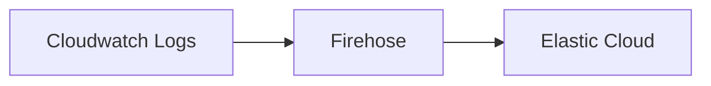

Issue: https://github.com/elastic/obs-infraobs-team/issues/1337.

## Current state 
Currently, this repository is only working for situation:

To get it to work you can read the [README](terraform/README.md) file inside the terraform directory.
To generate logs inside the cloudwatch, go to `go-script` and follow the [instructions](go-script/README.md) there.