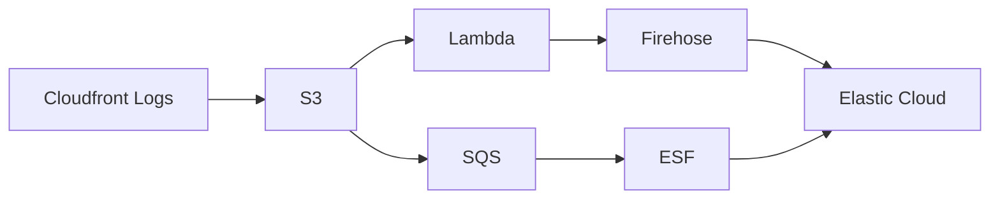
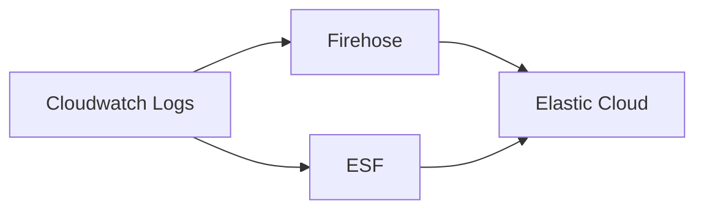
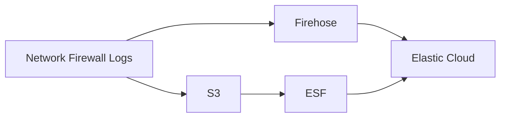

**Under construction...**

Issue: https://github.com/elastic/obs-infraobs-team/issues/1337.

## Usage

### Requirements

- Taskfile
- Terraform


### Variables configuration

There are two files you can change to update your configuration.

The first one is the `.env` file. It supports these variables:
- `DOWNLOAD`: set it to true if you want to download the ESF terraform directory, or false if you want to use local files for it.
- `ESF_LOCAL_DIRECTORY`: path to the local files for ESF terraform. If `DOWNLOAD` is set to `true`, it is not considered.
- `ESF_GIT_REPOSITORY`: repository where ESF terraform is, considered if `DOWNLOAD` set to `true`.

The second file is the one you place inside `terraform` directory, with suffix `auto.tfvars`. Here you can need to place the values for all terraform variables. You can find all possible variables and respective descriptions in `terraform/variables.tf`. **Make sure to place all required variables in this file**, they will be necessary for all tasks to run successfully. Example of correct configuration:

```terraform
aws_region     = "eu-west-2"
aws_access_key = "..."
aws_secret_key = "..."

resource_name_prefix = "constanca-tests"

es_url        = "..."
es_access_key = "..."

esf_release_version = "lambda-v1.9.0"

test_workflow = 2
```

### Run

To deploy all resources to make a workflow run:

```bash
task
```


To destroy the resources deployed by terraform, run:
```bash
task destroy
```

## Workflows

When you run the command `task`, there are two things happening:
1. Terraform runs to deploy all AWS necessary resources.
2. Go code runs to send data to those AWS resources.

You can pick the data workflow to run by setting the terraform variable `test_workflow`. You just have to define the number of the workflow to run.

The possible options are shown bellow.

### Workflow 1


Status: doesn't work for ESF and Firehose at the same time.

Note: not possible to have event trigger twice, ESF and Firehose cannot be set at the same time.

### Workflow 2



Status: working.

### Workflow 3



Status: figuring out how to set network firewall logs...

## Repository walkover


### `scripts` directory

This directory has two folders, `bash` and `go`.

`bash` directory contains all bash scripts that are being used by our taskfile.

`go` directory contains the go code used to produce data in our AWS resources. It works as follows:

1. We will enter the directory defined in `terraformDir`:
    1. We will open all files `*.auto.tfvars`.
    2. We will read every variable inside these files and save them in a map, both the key and the value of the variable.
2. We will create a new AWS session. For this, make sure that the following variables were present in the `*.auto.tfvars` files:
    - `aws_region`
    - `aws_access_key`
    - `aws_secret_key`
    - `resource_name_prefix`
3. If `1` is included `test_workflows` then:
4. If `2` is included `test_workflows` then:
   1. We will obtain the Cloudwatch Logs Group named `${resource_name_prefix}-cloudwatch-lg`.
   2. We will create a new log stream inside this group.
   3. We will send logs periodically to this log stream.


