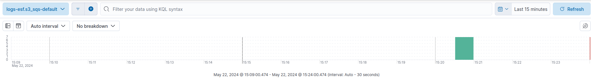
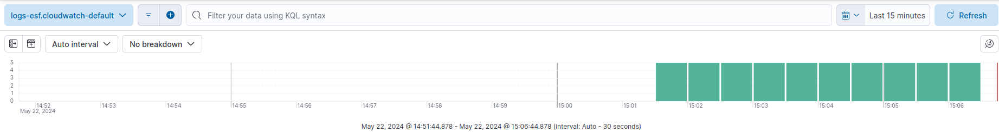

Issue: https://github.com/elastic/obs-infraobs-team/issues/1337.

## Usage

### Requirements

- Taskfile
- Terraform


### Variables configuration

There are two files you can change to update your configuration.

The first one is the `.env` file. It supports these variables:
- `DOWNLOAD`: set it to true if you want to download the ESF terraform directory, or false if you want to use local files for it.
- `ESF_LOCAL_DIRECTORY`: path to the local files for ESF terraform. If `DOWNLOAD` is set to `true`, it is not considered.
- `ESF_GIT_REPOSITORY`: repository where ESF terraform is, considered if `DOWNLOAD` set to `true`.

The second file is the one you place inside `terraform` directory, with suffix `auto.tfvars`. Here you can need to place the values for all terraform variables. You can find all possible variables and respective descriptions in `terraform/variables.tf`. **Make sure to place all required variables in this file**, they will be necessary for all tasks to run successfully. Example of correct configuration:

```terraform
aws_region           = "eu-west-2"
aws_access_key       = "..."
aws_secret_key       = "..."
resource_name_prefix = "constanca-benchmarking"
es_url               = "..."
es_access_key        = "..."
esf_release_version  = "lambda-v1.14.0"

test_workflow   = 3
create_firehose = 0
```

### Run

To deploy all resources to make a workflow run:

- If `create_firehose = 1`:

```bash
task run-firehose
```

- If `create_firehose = 0`:

```bash
task run-esf
```


To destroy the resources deployed by terraform, run:
```bash
task destroy
```

## Workflows

When you run the command `task`, there are two things happening:
1. Terraform runs to deploy all AWS necessary resources.
2. Go code runs to send data to those AWS resources.

You can pick the data workflow to run by setting the terraform variable `test_workflow`. You just have to define the number of the workflow to run.

The possible options are shown bellow.

I also show how you should set all variables. For all these examples, my `.env` file looks like this:

```env
DOWNLOAD=false
ESF_GIT_REPOSITORY=elastic/terraform-elastic-esf
ESF_LOCAL_DIRECTORY=/home/c/Documents/Git-Forks/Elastic/terraform-elastic-esf
```

### Workflow 1


> **WARNING**: Cloudfront Logs places a `.gz` file in S3. This file is read by ESF, and each line is sent separately to ESF. For Firehose, the whole document is sent as defined in the Lambda function. Maybe this function needs to be changed to send a single line as well.
> 
> **WARNING**: [CloudFront delivers access logs on a best-effort basis.](https://docs.aws.amazon.com/AmazonCloudFront/latest/DeveloperGuide/AccessLogs.html) This workflow is probably not worth testing, since the logs delivery running for Lambda -> Firehose can be very different from the one for SQS -> S3.


#### Testing - Firehose


I placed a file with suffix `auto.tfvars` in `terraform` directory. It looks like this:

```terraform
test_workflow = 1
create_firehose = 1

# Add the remaining variables
```

Now I just ran:

```bash
task run-firehose
```

This should deploy all necessary resources.

If I look in Discover, I should see data in `logs-firehose_workflow1-default`:


#### Testing - ESF


I placed a file with suffix `auto.tfvars` in `terraform` directory. It looks like this:

```terraform
test_workflow = 1
create_firehose = 0

# Add the remaining variables
```

Now I just ran:

```bash
task run-esf
```

This should deploy all necessary resources.

If I look in Discover, I should see data in `logs-esf.s3_sqs-default`:




### Workflow 2


#### Testing - Firehose


I placed a file with suffix `auto.tfvars` in `terraform` directory. It looks like this:

```terraform
test_workflow = 2
create_firehose = 1

# Add the remaining variables
```

Now I just ran:

```bash
task run-firehose
```

This should deploy all necessary resources.

If I look in Discover, I should see data in `logs-firehose_workflow2-default`:


#### Testing - ESF


I placed a file with suffix `auto.tfvars` in `terraform` directory. It looks like this:

```terraform
test_workflow = 2
create_firehose = 0

# Add the remaining variables
```

Now I just ran:

```bash
task run-esf
```

This should deploy all necessary resources.

If I look in Discover, I should see data in `logs-esf.cloudwatch-default`:



### Workflow 3

In workflow 3, logs come from Network Firewall Logs. These logs can be sent to: Kinesis Firehose, Cloudwatch or S3. Out of these options, ESF can get logs from Cloudwatch or S3 - for this, it needs to use SQS. I will use Cloudwatch since it has a more friendly user setup.


#### Testing - Firehose


I placed a file with suffix `auto.tfvars` in `terraform` directory. It looks like this:

```terraform
test_workflow = 3
create_firehose = 1

# Add the remaining variables
```

Now I just ran:

```bash
task run-firehose
```

This should deploy all necessary resources.

It takes some time, but if I look in Discover, I should see data in `logs-firehose_workflow3-default`:


#### Testing - ESF


I placed a file with suffix `auto.tfvars` in `terraform` directory. It looks like this:

```terraform
test_workflow = 3
create_firehose = 0

# Add the remaining variables
```

Now I just ran:

```bash
task run-esf
```

This should deploy all necessary resources.

If I look in Discover, I should see data in `logs-esf.cloudwatch-default`:


## Repository walkover


### `scripts` directory

This directory has two folders, `bash` and `go`.

`bash` directory contains all bash scripts that are being used by our taskfile.

`go` directory contains the go code used to produce data in our AWS resources. It works as follows:

1. We will enter the directory defined in `terraformDir`:
    1. We will open all files `*.auto.tfvars`.
    2. We will read every variable inside these files and save them in a map, both the key and the value of the variable.
2. We will create a new AWS session. For this, make sure that the following variables were present in the `*.auto.tfvars` files:
    - `aws_region`
    - `aws_access_key`
    - `aws_secret_key`
    - `resource_name_prefix`
    - `test_workflow`
3. If `test_workflow` is 1 then:
   1. We will obtain the Cloudwatch Logs Group named `${resource_name_prefix}-cloudfront-origin.s3.amazonaws.com`.
   2. We send an HTTP request to it to generate logs.
4. If `test_workflow` is 2 then:
   1. We will obtain the Cloudwatch Logs Group named `${resource_name_prefix}-cloudwatch-lg`.
   2. We will create a new log stream inside this group.
   3. We will send logs periodically to this log stream.
5. If `test_workflow` is 3 then a message is printed.


