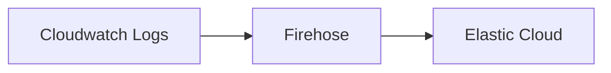

## Workflow

## How to run

1. Create a file `*.auto.tfvars` to place the values of the variables.
2. Run `terraform init`.
3. Run `terraform apply`.

<!-- Output of terraform-docs markdown -->

## Requirements

| Name | Version |
|------|---------|
|  [terraform](#requirement\_terraform) | >= 1.2.0 |
|  [aws](#requirement\_aws) | ~> 5.42.0 |

## Providers

| Name | Version |
|------|---------|
|  [aws](#provider\_aws) | 5.42.0 |

## Modules

No modules.

## Resources

| Name | Type |
|------|------|
| [aws_cloudwatch_log_group.cloudwatch_log_group](https://registry.terraform.io/providers/hashicorp/aws/latest/docs/resources/cloudwatch_log_group) | resource |
| [aws_cloudwatch_log_group.cloudwatch_log_group_errors](https://registry.terraform.io/providers/hashicorp/aws/latest/docs/resources/cloudwatch_log_group) | resource |
| [aws_cloudwatch_log_stream.cloudwatch_endpoint_errors](https://registry.terraform.io/providers/hashicorp/aws/latest/docs/resources/cloudwatch_log_stream) | resource |
| [aws_cloudwatch_log_stream.cloudwatch_s3_errors](https://registry.terraform.io/providers/hashicorp/aws/latest/docs/resources/cloudwatch_log_stream) | resource |
| [aws_cloudwatch_log_subscription_filter.cloudwatch_subscription](https://registry.terraform.io/providers/hashicorp/aws/latest/docs/resources/cloudwatch_log_subscription_filter) | resource |
| [aws_iam_policy.cloudwatch_policy](https://registry.terraform.io/providers/hashicorp/aws/latest/docs/resources/iam_policy) | resource |
| [aws_iam_policy.firehose_permissions_policy](https://registry.terraform.io/providers/hashicorp/aws/latest/docs/resources/iam_policy) | resource |
| [aws_iam_role.cloudwatch_role](https://registry.terraform.io/providers/hashicorp/aws/latest/docs/resources/iam_role) | resource |
| [aws_iam_role.firehose_role](https://registry.terraform.io/providers/hashicorp/aws/latest/docs/resources/iam_role) | resource |
| [aws_iam_role_policy_attachment.cloudwatch_role_policy](https://registry.terraform.io/providers/hashicorp/aws/latest/docs/resources/iam_role_policy_attachment) | resource |
| [aws_iam_role_policy_attachment.firehose_permissions](https://registry.terraform.io/providers/hashicorp/aws/latest/docs/resources/iam_role_policy_attachment) | resource |
| [aws_kinesis_firehose_delivery_stream.firehose_delivery_stream](https://registry.terraform.io/providers/hashicorp/aws/latest/docs/resources/kinesis_firehose_delivery_stream) | resource |
| [aws_s3_bucket.s3_bucket_esf](https://registry.terraform.io/providers/hashicorp/aws/latest/docs/resources/s3_bucket) | resource |
| [aws_s3_bucket.s3_bucket_firehose](https://registry.terraform.io/providers/hashicorp/aws/latest/docs/resources/s3_bucket) | resource |
| [aws_s3_object.esf-config-file-upload](https://registry.terraform.io/providers/hashicorp/aws/latest/docs/resources/s3_object) | resource |
| [aws_iam_policy_document.cloudwatch_policy_document](https://registry.terraform.io/providers/hashicorp/aws/latest/docs/data-sources/iam_policy_document) | data source |
| [aws_iam_policy_document.cloudwatch_role_document](https://registry.terraform.io/providers/hashicorp/aws/latest/docs/data-sources/iam_policy_document) | data source |
| [aws_iam_policy_document.firehose_policy_permissions_document](https://registry.terraform.io/providers/hashicorp/aws/latest/docs/data-sources/iam_policy_document) | data source |
| [aws_iam_policy_document.firehose_policy_role_document](https://registry.terraform.io/providers/hashicorp/aws/latest/docs/data-sources/iam_policy_document) | data source |

## Inputs

| Name | Description | Type | Default | Required |
|------|-------------|------|---------|:--------:|
|  [aws\_access\_key](#input\_aws\_access\_key) | AWS access key | `string` | n/a | yes |
|  [aws\_region](#input\_aws\_region) | AWS Region | `string` | n/a | yes |
|  [aws\_secret\_key](#input\_aws\_secret\_key) | AWS secret key | `string` | n/a | yes |
|  [datastream\_name](#input\_datastream\_name) | Datastream name used by Firehose | `string` | `"logs-aws.cloudwatch_logs-default"` | no |
|  [es\_access\_key](#input\_es\_access\_key) | Elasticsearch access key | `string` | n/a | yes |
|  [es\_url](#input\_es\_url) | Elasticsearch endpoint URL | `string` | n/a | yes |
|  [resource\_name\_prefix](#input\_resource\_name\_prefix) | Prefix for each resource name created from the configuration files | `string` | n/a | yes |

## Outputs

No outputs.

<!-- End of output -->