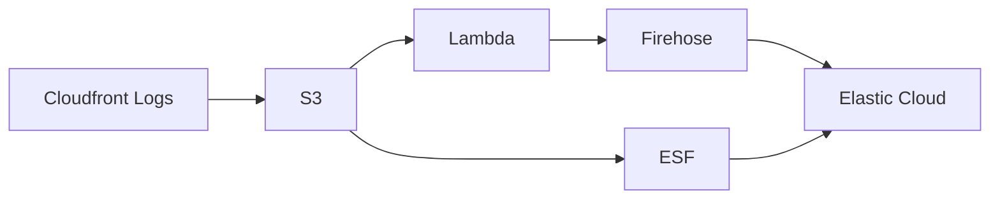
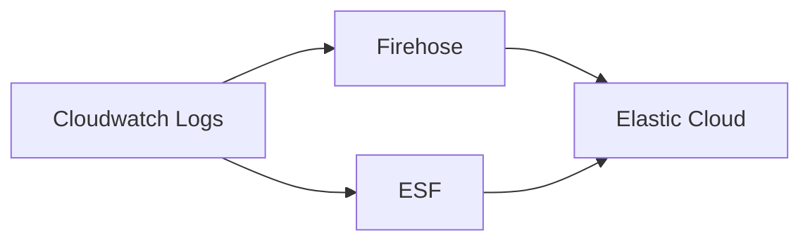
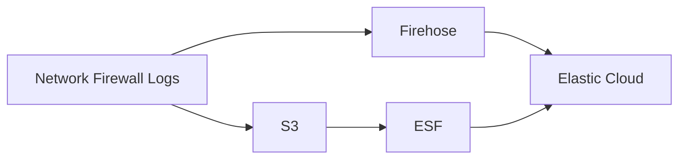

**Currently, it only works for workflow-2 and using Firehose.**
**You can deploy ESF by using the terraform files https://github.com/elastic/elastic-serverless-forwarder (they are also a work in progress...)**

## Structure

- `terraform`: all `tf` configuration files are placed here
  - `requirements`
    - `esf`: creates the necessary resources ESF needs. **TODO**: Because ESF is not configured yet, we are not applying it (`count = 0`)
    - `firehose`: creates the necessary resources Firehose needs. It is always applied.
  - `workflow-1`: **TODO**
  - `workflow-2`: creates the cloudwatch logs group that ESF and Firehose will subscribe to. See _Worflows_ section below.
  It will be applied if `test_workflows` variable includes the number 2.
  - `worflow-3`: **TODO**: find a way generate Firewall logs, some resources are deployed here already.

## Workflows

Workflow 1:

Workflow 2:

Workflow 3:

## How to run

1. Create a file `*.auto.tfvars` to place the values of the variables. You can see the variables in `variables.tf`.
> **Important**: The only variables meant to be changed by the user are the ones in the `variables.tf` file in this directory. 
> The other `variables.tf` files in nested directories are used and set by the program.
2. Run `terraform init`.
3. Run `terraform apply`.

<!-- Output of terraform-docs markdown -->

<!-- End of output -->