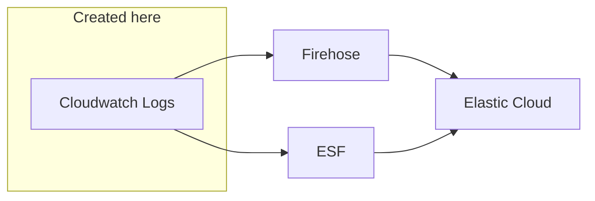

Create necessary resources to have a Cloudwatch Logs Group that can be used in workflow 2.

```mermaid
flowchart LR
    subgraph Created here
        cloudwatch[Cloudwatch Logs]
    end
    
    cloudwatch[Cloudwatch Logs] --> firehose[Firehose]
    firehose[Firehose] --> elastic[Elastic Cloud]

    cloudwatch[Cloudwatch Logs] --> ESF[ESF]
    ESF[ESF] --> elastic[Elastic Cloud]
```