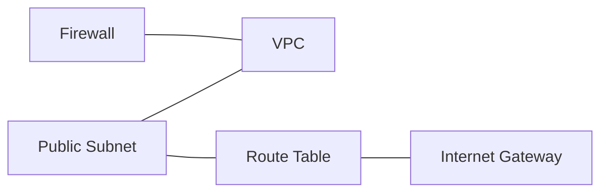

Create necessary resources to have Network Firewall Logs.

The firewall policy is associated with a VPC and one of its subnets.

We need an EC2 instance in a VPC.

Since an EC2 instance needs to have a public subnet (we will use the same one that is associated with the firewall policy), we also create an internet gateway. To make the subnet public, this gateway will be associated with that subnet through a route table.

To connect to the EC2 Instance we will also create a security group to allow access to port 22.

Reference: https://docs.aws.amazon.com/AWSEC2/latest/UserGuide/ec2-instance-connect-prerequisites.html.

