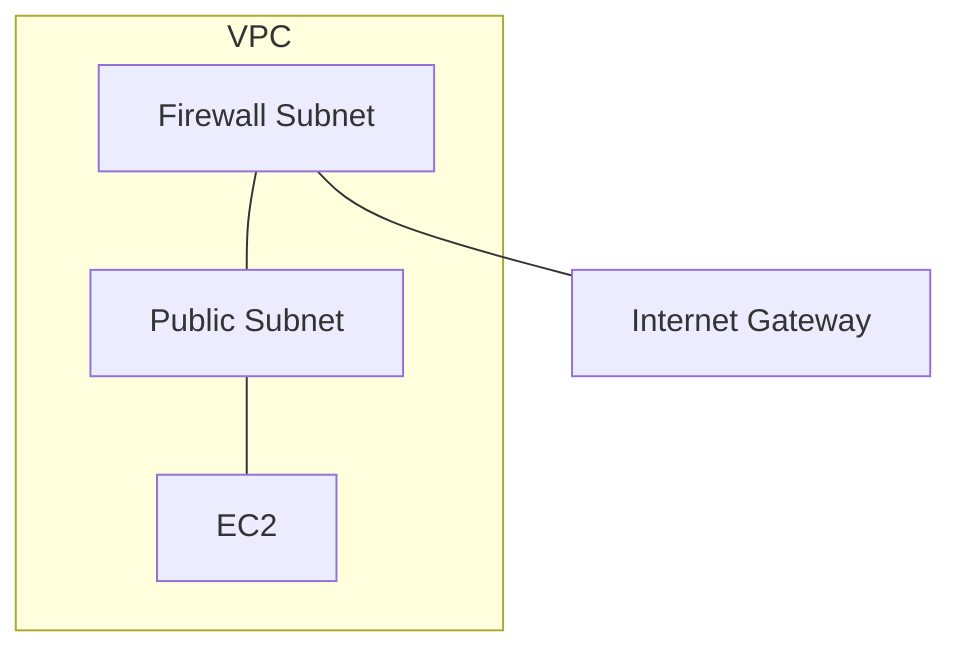

```mermaid
flowchart TB
    subgraph vpc["VPC"]
        firewall_subnet["Firewall Subnet"] --- public_subnet["Public Subnet"]
        public_subnet --- ec2["EC2"]
    end
    firewall_subnet --- igw["Internet Gateway"]

```

Good examples can be found [here](https://aws.amazon.com/blogs/networking-and-content-delivery/deployment-models-for-aws-network-firewall/).