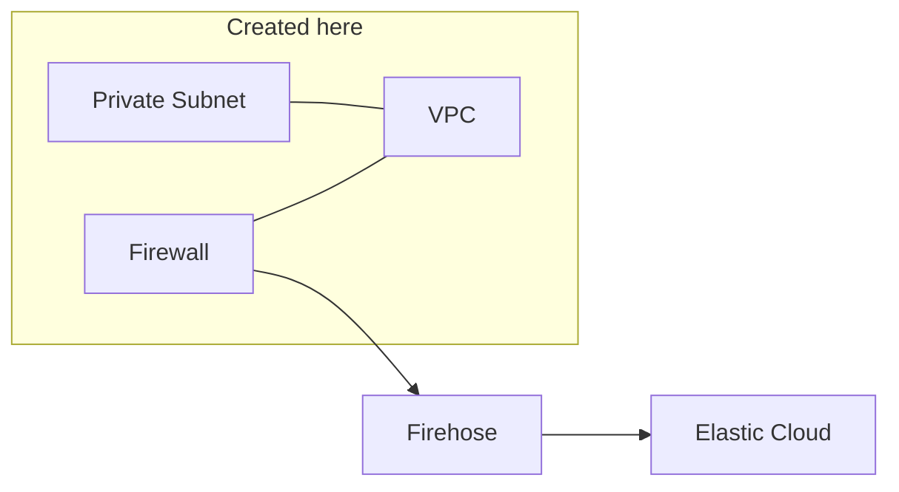

Create necessary resources to have Network Firewall Logs.

```mermaid
flowchart LR
    subgraph Created here
        firewall[Firewall] --- vpc[VPC]
        subnet[Private Subnet] --- vpc[VPC]
    end
    firewall[Firewall] --> firehose[Firehose]
    firehose[Firehose] --> elastic[Elastic Cloud]
```